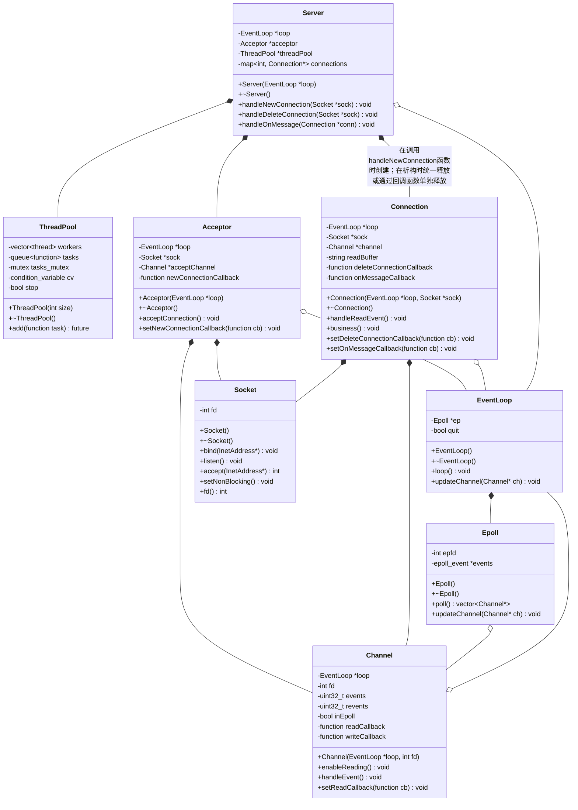

    %% 关系定义
    Server *-- ThreadPool : 组合 (Server 拥有 ThreadPool)
    Server o-- Connection : 聚合 (Server 管理 Connection)

```mermaid
classDiagram
    %% =======================
    %% 核心引擎层 (Reactor Core)
    %% =======================
    class EventLoop {
        -Epoll *ep
        -bool quit
        +EventLoop()
        +~EventLoop()
        +loop() void
        +updateChannel(Channel* ch) void
    }

    class Epoll {
        -int epfd
        -epoll_event *events
        +Epoll()
        +~Epoll()
        +poll() vector~Channel*~
        +updateChannel(Channel* ch) void
    }

    class Channel {
        -EventLoop *loop
        -int fd
        -uint32_t events
        -uint32_t revents
        -bool inEpoll
        -function readCallback
        -function writeCallback
        +Channel(EventLoop *loop, int fd)
        +enableReading() void
        +handleEvent() void
        +setReadCallback(function cb) void
    }

    %% =======================
    %% 资源管理层 (Resource)
    %% =======================
    class Socket {
        -int fd
        +Socket()
        +~Socket()
        +bind(InetAddress*) void
        +listen() void
        +accept(InetAddress*) int
        +setNonBlocking() void
        +fd() int
    }

    class ThreadPool {
        -vector~thread~ workers
        -queue~function~ tasks
        -mutex tasks_mutex
        -condition_variable cv
        -bool stop
        +ThreadPool(int size)
        +~ThreadPool()
        +add(function task) future
    }

    %% =======================
    %% 业务接入层 (Business Access)
    %% =======================
    class Acceptor {
        -EventLoop *loop
        -Socket *sock
        -Channel *acceptChannel
        -function newConnectionCallback
        +Acceptor(EventLoop *loop)
        +~Acceptor()
        +acceptConnection() void
        +setNewConnectionCallback(function cb) void
    }

    class Connection {
        -EventLoop *loop
        -Socket *sock
        -Channel *channel
        -string readBuffer
        -function deleteConnectionCallback
        -function onMessageCallback
        +Connection(EventLoop *loop, Socket *sock)
        +~Connection()
        +handleReadEvent() void
        +business() void
        +setDeleteConnectionCallback(function cb) void
        +setOnMessageCallback(function cb) void
    }

    %% =======================
    %% 中央控制层 (Controller)
    %% =======================
    class Server {
        -EventLoop *loop
        -Acceptor *acceptor
        -ThreadPool *threadPool
        -map~int, Connection*~ connections
        +Server(EventLoop *loop)
        +~Server()
        +handleNewConnection(Socket *sock) void
        +handleDeleteConnection(Socket *sock) void
        +handleOnMessage(Connection *conn) void
    }

    %% =======================
    %% 关系连线
    %% =======================
    
    %% 1. EventLoop 独占 Epoll
    EventLoop *-- Epoll 
    
    %% 2. Channel 依赖 EventLoop (把自己的 fd 注册进去)
    Channel o-- EventLoop
    
    %% 3. Acceptor 
    Acceptor *-- Socket
    Acceptor *-- Channel
    Acceptor o-- EventLoop
    
    %% 4. Connection 拥有 Socket 和 Channel
    Connection *-- Socket
    Connection *-- Channel
    Connection o-- EventLoop

    %% 5. Server 
    Server *-- Acceptor
    Server *-- ThreadPool
    Server *-- Connection : 在调用handleNewConnection函数时创建；在析构时统一释放或通过回调函数单独释放
    Server o-- EventLoop

    %% 6. Epoll 实际上持有 Channel 指针 (通过 epoll_event.data.ptr)
    Epoll o-- Channel 
```

