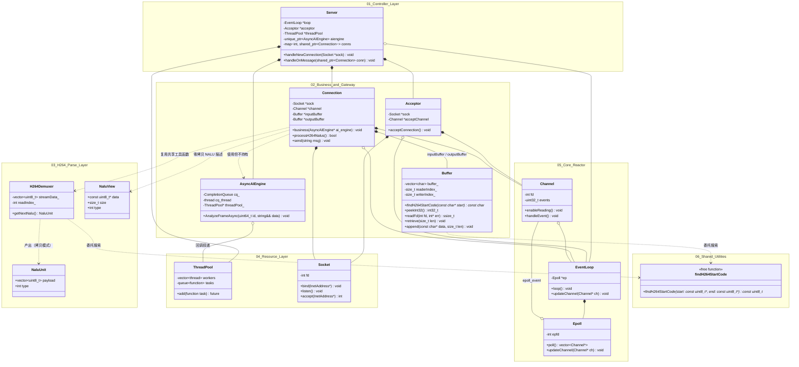

```mermaid
classDiagram
    %% ==========================================
    %% 关系连线（自顶向下编排，Mermaid 按书写顺序布局）
    %% ==========================================

    %% ---------- Server 层 ----------
    Server *-- Acceptor
    Server *-- ThreadPool
    Server *-- AsyncAIEngine
    Server *-- Connection
    Server o-- EventLoop

    %% ---------- 业务层依赖 ----------
    Acceptor *-- Socket
    Acceptor *-- Channel
    Acceptor o-- EventLoop

    Connection *-- Socket
    Connection *-- Channel
    Connection o-- EventLoop
    Connection *-- Buffer : inputBuffer / outputBuffer
    Connection ..> AsyncAIEngine : 使用但不持有
    Connection ..> H264Demuxer : 复用共享工具函数
    Connection ..> NaluView : 零拷贝 NALU 描述

    AsyncAIEngine o-- ThreadPool : 回调投递

    %% ---------- H.264 解复用层 ----------
    H264Demuxer ..> NaluUnit : 产出（拷贝模式）
    H264Demuxer ..> findH264StartCode : 委托搜索
    Buffer ..> findH264StartCode : 委托搜索

    %% ---------- 底层 Reactor ----------
    EventLoop *-- Epoll
    Channel o-- EventLoop
    Epoll o-- Channel : epoll_event

    %% ==========================================
    %% 类定义
    %% ==========================================

    namespace 01_Controller_Layer {
        class Server {
            -EventLoop *loop
            -Acceptor *acceptor
            -ThreadPool *threadPool
            -unique_ptr~AsyncAIEngine~ aiengine
            -map~int, shared_ptr~Connection~~ conns
            +handleNewConnection(Socket *sock) void
            +handleOnMessage(shared_ptr~Connection~ conn) void
        }
    }

    namespace 02_Business_and_Gateway {
        class Acceptor {
            -Socket *sock
            -Channel *acceptChannel
            +acceptConnection() void
        }

        class Connection {
            -Socket *sock
            -Channel *channel
            -Buffer *inputBuffer
            -Buffer *outputBuffer
            +business(AsyncAIEngine* ai_engine) void
            +processH264Nalus() bool
            +send(string msg) void
        }

        class AsyncAIEngine {
            -CompletionQueue cq_
            -thread cq_thread
            -ThreadPool* threadPool_
            +AnalyzeFrameAsync(uint64_t id, string&& data) void
        }

        class Buffer {
            -vector~char~ buffer_
            -size_t readerIndex_
            -size_t writerIndex_
            +findH264StartCode(const char* start) const char*
            +peekInt32() int32_t
            +readFd(int fd, int* err) ssize_t
            +retrieve(size_t len) void
            +append(const char* data, size_t len) void
        }
    }

    namespace 03_H264_Parse_Layer {
        class H264Demuxer {
            -vector~uint8_t~ streamData_
            -int readIndex_
            +getNextNalu() NaluUnit
        }

        class NaluUnit {
            +vector~uint8_t~ payload
            +int type
        }

        class NaluView {
            +const uint8_t* data
            +size_t size
            +int type
        }
    }

    namespace 04_Resource_Layer {
        class Socket {
            -int fd
            +bind(InetAddress*) void
            +listen() void
            +accept(InetAddress*) int
        }

        class ThreadPool {
            -vector~thread~ workers
            -queue~function~ tasks
            +add(function task) future
        }
    }

    namespace 05_Core_Reactor {
        class EventLoop {
            -Epoll *ep
            +loop() void
            +updateChannel(Channel* ch) void
        }

        class Epoll {
            -int epfd
            +poll() vector~Channel*~
            +updateChannel(Channel* ch) void
        }

        class Channel {
            -int fd
            -uint32_t events
            +enableReading() void
            +handleEvent() void
        }
    }

    namespace 06_Shared_Utilities {
        class findH264StartCode {
            <<free function>>
            +findH264StartCode(start: const uint8_t*, end: const uint8_t*) const uint8_t*
        }
    }
```
