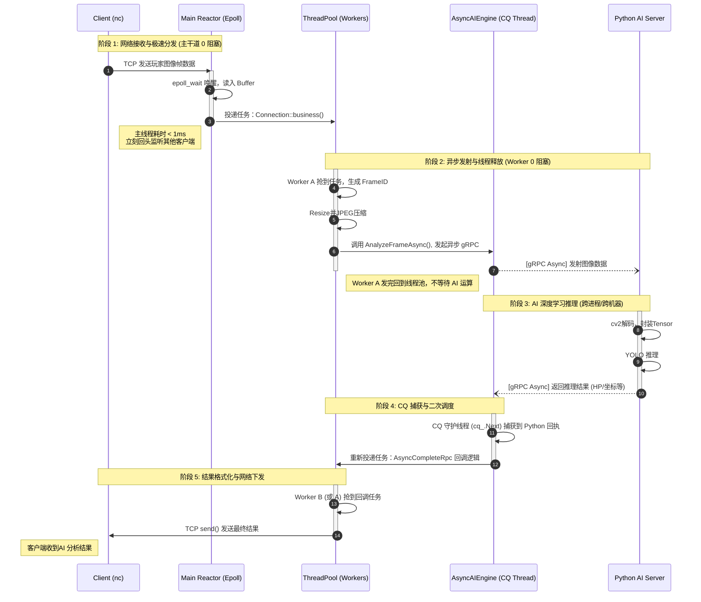

```mermaid
sequenceDiagram
    autonumber
    
    %% 定义参与者，按照真实的物理边界排列
    participant C as  Client (nc)
    participant M as  Main Reactor (Epoll)
    participant TP as  ThreadPool (Workers)
    participant AI as  AsyncAIEngine (CQ Thread)
    participant Py as  Python AI Server

    Note over C, M: 阶段 1: 网络接收与极速分发 (主干道 0 阻塞)
    C->>M: TCP 发送玩家图像帧数据
    activate M
    M->>M: epoll_wait 唤醒，读入 Buffer
    M->>TP: 投递任务：Connection::business()
    deactivate M
    Note left of M: 主线程耗时 < 1ms<br/>立刻回头监听其他客户端

    Note over TP, Py: 阶段 2: 异步发射与线程释放 (Worker 0 阻塞)
    activate TP
    TP->>TP: Worker A 抢到任务，生成 FrameID
    TP->>TP: Resize并JPEG压缩
    TP->>AI: 调用 AnalyzeFrameAsync(), 发起异步 gRPC
    AI--)Py: [gRPC Async] 发射图像数据
    deactivate TP
    Note right of TP: Worker A 发完回到线程池，不等待 AI 运算

    Note over AI, Py: 阶段 3: AI 深度学习推理 (跨进程/跨机器)
    activate Py
    Py->>Py: cv2解码，封装Tensor
    Py->>Py: YOLO 推理 
    Py--)AI: [gRPC Async] 返回推理结果 (HP/坐标等)
    deactivate Py

    Note over TP, AI: 阶段 4: CQ 捕获与二次调度
    activate AI
    AI->>AI: CQ 守护线程 (cq_.Next) 捕获到 Python 回执
    AI->>TP: 重新投递任务：AsyncCompleteRpc 回调逻辑
    deactivate AI

    Note over C, TP: 阶段 5: 结果格式化与网络下发
    activate TP
    TP->>TP: Worker B (或 A) 抢到回调任务
    TP->>C: TCP send() 发送最终结果
    deactivate TP
    Note left of C: 客户端收到AI 分析结果
```