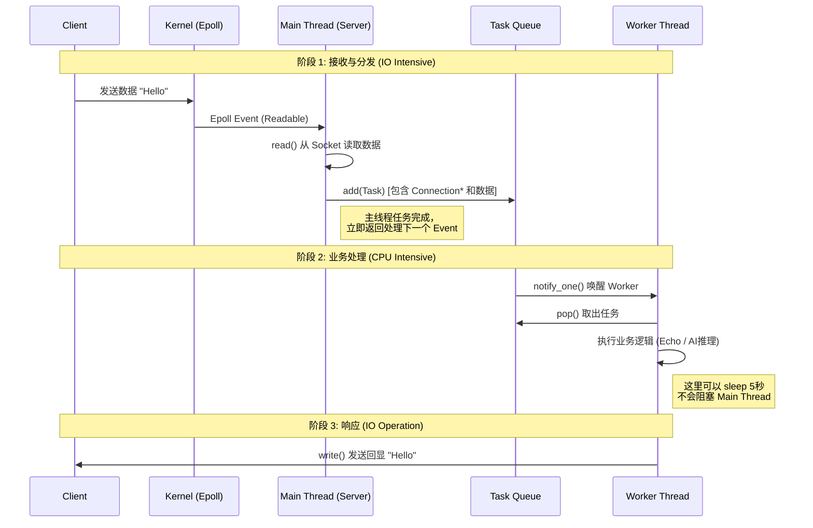

```mermaid
sequenceDiagram
    participant C as Client
    participant OS as Kernel (Epoll)
    participant M as Main Thread (Server)
    participant Q as Task Queue
    participant W as Worker Thread

    Note over C, W: 阶段 1: 接收与分发 (IO Intensive)
    C->>OS: 发送数据 "Hello"
    OS->>M: Epoll Event (Readable)
    M->>M: read() 从 Socket 读取数据
    M->>Q: add(Task) [包含 Connection* 和数据]
    Note right of M: 主线程任务完成，<br/>立即返回处理下一个 Event
    
    Note over C, W: 阶段 2: 业务处理 (CPU Intensive)
    Q->>W: notify_one() 唤醒 Worker
    W->>Q: pop() 取出任务
    W->>W: 执行业务逻辑 (Echo / AI推理)
    Note right of W: 这里可以 sleep 5秒<br/>不会阻塞 Main Thread
    
    Note over C, W: 阶段 3: 响应 (IO Operation)
    W->>C: write() 发送回显 "Hello"
```