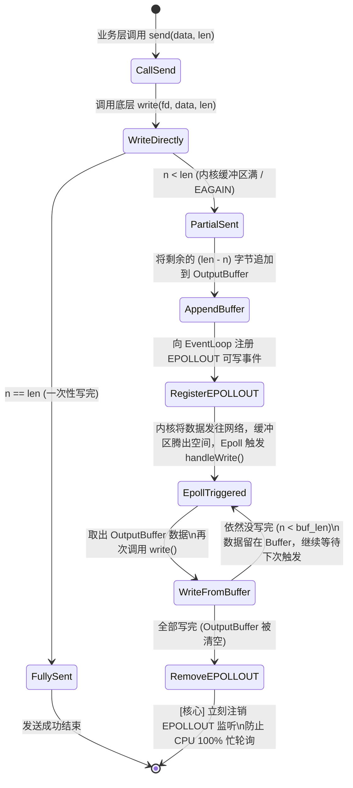

```mermaid
stateDiagram
    [*] --> CallSend : 业务层调用 send(data, len)
    CallSend --> WriteDirectly : 调用底层 write(fd, data, len)
    
    WriteDirectly --> FullySent : n == len (一次性写完)
    FullySent --> [*] : 发送成功结束
    
    WriteDirectly --> PartialSent : n < len (内核缓冲区满 / EAGAIN)
    PartialSent --> AppendBuffer : 将剩余的 (len - n) 字节追加到 OutputBuffer
    AppendBuffer --> RegisterEPOLLOUT : 向 EventLoop 注册 EPOLLOUT 可写事件
    
    RegisterEPOLLOUT --> EpollTriggered : 内核将数据发往网络，缓冲区腾出空间，Epoll 触发 handleWrite()
    EpollTriggered --> WriteFromBuffer : 取出 OutputBuffer 数据\n再次调用 write()
    
    WriteFromBuffer --> EpollTriggered : 依然没写完 (n < buf_len)\n数据留在 Buffer，继续等待下次触发
    WriteFromBuffer --> RemoveEPOLLOUT : 全部写完 (OutputBuffer 被清空)
    RemoveEPOLLOUT --> [*] : [核心] 立刻注销 EPOLLOUT 监听\n防止 CPU 100% 忙轮询
```

