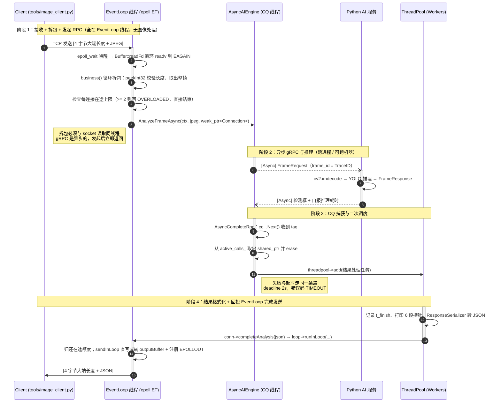

# 01 架构与数据流

本文只描述当前代码里存在的东西。所有结论都能在源码里指到位置。

## 1. 组件与持有关系

```text
main()
 └─ EventLoop                 ← 栈上对象，持有 Epoll 与 wakeupChannel_
     └─ Server                ← 栈上对象
         ├─ Acceptor           (裸指针，Server 负责 delete)
         │   ├─ Socket         (监听 fd，RAII)
         │   └─ Channel        (监听 fd 的读事件)
         ├─ ThreadPool         (裸指针，4 个 worker)
         ├─ AsyncAIEngine      (unique_ptr；持有 gRPC Stub + CompletionQueue + CQ 线程)
         └─ conns: map<int, shared_ptr<Connection>>   ← 以 fd 为键
                 └─ Connection          (唯一所有者是这张 map)
                     ├─ Socket          (客户端 fd，RAII)
                     ├─ Channel         (读写回调 + tie)
                     ├─ inputBuffer     (收帧)
                     └─ outputBuffer    (发帧)
```

这份组件图只画了「网关侧」。推理侧是独立的 Python 进程（`Pserver.py` / `dummy_server.py`），不在本进程内，
只通过 gRPC 与 `AsyncAIEngine` 相连；它可以在同一台机器上，也可以在另一台机器上（例如 Windows + GPU）。

关键点：`Connection` 的强引用只有一处（`Server::conns`）。`Channel::tie_` 是 `weak_ptr`，不增加引用计数；
只有在 epoll 事件回调期间，`Channel::handleEvent()` 会把它提升成一个临时的局部强引用。

## 2. 线程归属（最重要的一张表）

| 资源 | 只允许被谁修改 | 其他线程怎么改 |
| --- | --- | --- |
| `inputBuffer` / `outputBuffer` | EventLoop 线程 | 通过 `Connection::send()` → `EventLoop::runInLoop()` 投递闭包 |
| `Channel::events` / `isadd` | EventLoop 线程 | 同上 |
| `epoll`（`epoll_ctl`） | EventLoop 线程 | 同上 |
| `Connection::state_` / `in_flight_requests_` | EventLoop 线程 | `completeAnalysis()` 里的闭包 |
| `AsyncAIEngine::active_calls_` | 任意线程，由 `mu_` 保护 | — |
| `ThreadPool::tasks` | 任意线程，由内部 mutex 保护 | — |
| `EventLoop::pendingFunctors_` | 任意线程，由 `pendingMutex_` 保护 | — |

跨线程投递的完整路径：

```text
Worker/CQ 线程调用 send() 或 completeAnalysis()
  → EventLoop::runInLoop(cb)
      在 Loop 线程？直接执行
      否则 → queueInLoop(cb)：加锁 push 进 pendingFunctors_，再往 eventfd 写 8 字节
  → epoll_wait 因为 wakeupChannel_ 可读而返回
  → Channel::handleEvent → EventLoop::handleWakeupRead（循环读 eventfd 直到 EAGAIN）
  → EventLoop::doPendingFunctors：先在锁内 swap 出整个 vector，再在锁外执行
```

`doPendingFunctors` 先 swap 再执行是有意的：闭包内部可以再 `queueInLoop`，且不会死锁。

## 3. 四条不变式

读代码时随时拿它们验证：

① `outputBuffer` 非空 ⇔ `EPOLLOUT` 已注册。
`sendInLoop` 只在追加数据时 `enableWriting()`；`handleWriteEvent` 排空后立刻 `disableWriting()`。
`sendInLoop` 的判断逻辑正是依赖这一条："缓冲区非空就只追加，否则才先试直写"。

顺带纠正一个常见误解：`EPOLLET` 是 fd 级属性。`enableReading()` 给注册项带上 `EPOLLET` 之后，
读写事件都是边缘触发，`EPOLLOUT` 并不例外。所以"排空"必须写到 `EAGAIN` 为止。

② 删除回调触发后，对象不会在事件处理中途析构。
`Server::handleDeleteConnection` 只是 `conns.erase(fd)`；此刻 `Channel::handleEvent()` 里的局部
`guard`（`tie_.lock()`）仍持有一个 `shared_ptr`，所以 `handleReadEvent` / `handleWriteEvent` 能安全返回。

③ `Channel` 必须先于 `Socket` 析构。
`Channel::~Channel()` 在 `isadd` 为真时调 `loop->removeChannel(this)`（即 `epoll_ctl(DEL)`）。
若先关 fd，`epoll_ctl` 就会作用在一个已关闭甚至被复用的 fd 上。
所以 `Connection::~Connection()` 的顺序是 `delete channel; delete sock;`，`Acceptor` 同理。

④ 停机必须先停 AI Engine，再删线程池。
`Server::~Server()`：`delete acceptor` → `conns.clear()` → `aiengine.reset()` → `delete threadPool`。
反过来的话，CQ 线程还活着并会往已析构的线程池里 `add()` 任务。

注意：`Server::~Server()` 在当前代码里运行时几乎跑不到——`main()` 里 `loop()` 是死循环，
且没有信号处理。这条顺序目前只在代码层面成立（见 [03 文档](03-实测与边界.md) 的边界表）。

## 4. 一帧的完整流转



## 5. 三处最容易记错的地方

1. 拆包不在线程池。`Server::handleOnMessage` 直接在 EventLoop 线程调 `conn->business()`——
   协议解析必须和 socket 读取同线程，否则会和 `handleReadEvent` 抢 `inputBuffer`。
2. C++ 侧不做图像处理。JPEG 原样透传给 Python，`business()` 里没有 resize、没有重编码。
   （`Buffer::makeSpace` 里出现的 `buffer_.resize()` 是缓冲区扩容，与图像无关。）
3. 发送回投到 EventLoop。Worker 只做 JSON 序列化，真正的 `write()`
   由 EventLoop 线程执行：`completeAnalysis` → `runInLoop` → `sendInLoop`。

## 6. Connection 的状态机

```text
kConnected ──对端 FIN / 读出错 / 写错误──► kDisconnecting ──outputBuffer 排空──► kDisconnected
                                              │
                                              └─ 若 outputBuffer 为空，立即回调删除
```

- `handleClose()`：置 `kDisconnecting`、`disableReading()`；若 `outputBuffer` 已空则立刻走删除回调，
  否则留着 `EPOLLOUT` 把残留数据发完再删（优雅挥手）。
- `sendInLoop()` 开头检查 `state_ == kDisconnected` 就直接返回——防止对象已"逻辑关闭"但仍被写入。
