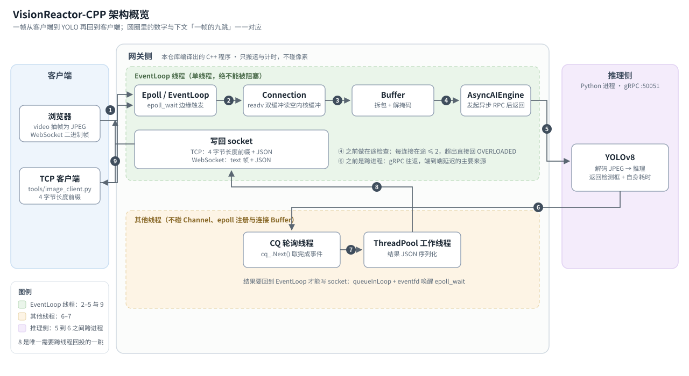
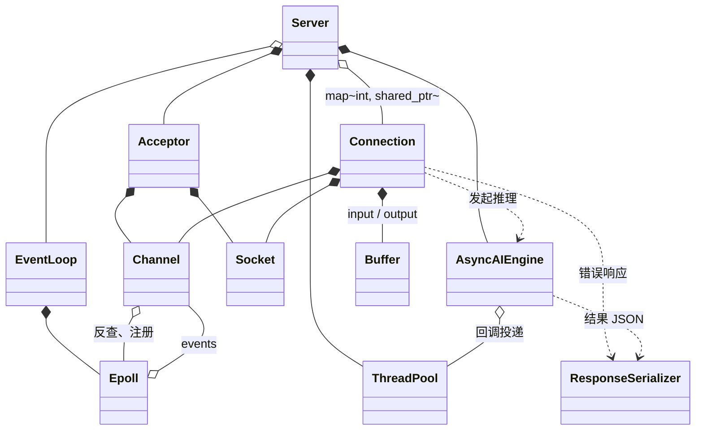

# 项目说明

讲各组件的职责、相互关系和主要取舍。只想先跑起来，看 [启动指南](启动指南.md)。

除第一节外，后面都用问答组织。

## 架构概览

系统分两侧：网关侧是本仓库编译出的 C++ 程序，推理侧是 Python 服务，两侧用 gRPC 通信。
网关只负责搬运和计时，不碰像素。



一帧的九跳：

1. 客户端发帧。TCP 是 `4 字节大端长度 + JPEG`，浏览器走 WebSocket 二进制帧（带掩码）
2. epoll（边缘触发）报告可读，交给 `Connection::handleReadEvent`
3. `readv` 双缓冲把内核缓冲区读空，原始字节落进 `Buffer`
4. `Buffer` 拆包（TCP 认长度前缀，WebSocket 先解掩码）。发起 RPC 之前做在途检查：
   每连接在途 ≤ 2，超出直接回 `OVERLOADED`
5. `AsyncAIEngine::AnalyzeFrameAsync` 发出异步 gRPC 请求后立刻返回，EventLoop 线程继续跑
6. 推理侧（跨进程）解码 JPEG 并推理，把 `FrameResponse` 回给网关
7. `CompletionQueue` 轮询线程取到完成事件
8. 结果任务投给线程池做 JSON 序列化，再 `queueInLoop` + `eventfd` 唤醒 Reactor
9. 回到 EventLoop 线程写 socket：TCP 是长度前缀 + JSON，WebSocket 是 text 帧

图里有三处值得留意：

- 2 到 5 都在 EventLoop 线程上，这段不能被阻塞
- 6 到 8 换了线程，结果回写要绕一圈 `queueInLoop` 回到 EventLoop
- 5 到 6 跨进程，这一跳是端到端延迟的主要来源

四种底色对应四个区域：客户端、EventLoop 线程、其他线程、推理侧。

视频帧始终是二进制 JPEG/PNG，不走 JSON 也不做 base64。JSON 只用在结果层
（检测框、类别、置信度、延迟数字），好处是浏览器能直接解析、调试时肉眼可读。
要压掉结果编码这部分开销，替换 `ResponseSerializer` 改成 protobuf 二进制即可，
它本来就是独立的一层。

## 能力清单

**这个网关提供哪些能力？**

- 双协议入口：原始 TCP（4 字节大端长度前缀）与 WebSocket 二进制帧，共用同一条后端链路
- 单 Reactor + epoll 边缘触发；跨线程操作用 `eventfd` + `queueInLoop` 回投 EventLoop 线程
- 异步 gRPC（`CompletionQueue` + tag 表），发起请求后立刻返回，Reactor 线程不被 RPC 阻塞
- 背压：每连接在途上限 2，超出回 `OVERLOADED`，不排队
- 链路延迟追踪：逐帧六个时间戳，网关侧净开销与推理耗时分开统计
- 浏览器演示：选视频、按设定帧率抽帧、实时叠加检测框与分段延迟

## 线程与所有权

**一个连接从建立到销毁，会经过哪些线程？**

只有三个线程来源，界面很小：

| 线程 | 谁创建 | 职责 | 不能碰的东西 |
| --- | --- | --- | --- |
| EventLoop 线程（主线程） | `main` | `epoll_wait`、读、拆包、发起 RPC、写回 | —— |
| CQ 轮询线程 | `AsyncAIEngine` | `CompletionQueue::Next()` 取完成事件，投递给线程池 | Channel、epoll 注册、连接 Buffer |
| ThreadPool 工作线程 | `Server` | 结果处理：JSON 序列化、日志 | 同上 |

**连接对象被谁持有？**

```text
Server
 ├── EventLoop（跑在主线程）
 ├── Acceptor（监听 socket）
 ├── ThreadPool（工作线程）
 ├── AsyncAIEngine（gRPC 存根 + CompletionQueue + 轮询线程）
 └── map<int, shared_ptr<Connection>>   ← 以 fd 为键

Connection
 ├── Socket、Channel
 └── inputBuffer、outputBuffer
```

**为什么跨线程操作必须走 `queueInLoop`？**

因为连接的 Buffer、Channel、epoll 注册状态只有一个所有者：EventLoop 线程。
其他线程想操作连接，必须把闭包投进 EventLoop 的待办队列，再用 `eventfd` 唤醒正在
`epoll_wait` 的 Reactor。这样"谁在什么时候改连接状态"始终只有一个答案，不需要给这些
数据结构加锁。

**回调回来的时候，怎么保证 `Connection` 还活着？**

`Channel::tie` 存的是 `weak_ptr`，不增加引用计数。它只在 `handleEvent` 期间提升成一个
局部 guard：提升成功就说明对象还在，回调可以放心执行；提升失败就什么都不做。
异步回投的结果同样只持有 `weak_ptr<Connection>`，客户端断开后结果自然被丢弃，
不会延长连接的生命周期。

这四条不变式解释了代码里的异常路径：

1. 连接的 Buffer、Channel、epoll 注册状态只在 EventLoop 线程改。
2. 跨线程操作一律 `queueInLoop` + `eventfd` 唤醒。
3. 异步回调只持 `weak_ptr`，提升失败即丢弃结果。
4. 每连接在途请求上限 2，超出直接拒绝，不排队。

## 关键设计取舍

**为什么用单 Reactor，而不是 one-loop-per-thread？**

推理占端到端时间的绝大部分（14.3 ms 对网关侧的 63 µs），Reactor 不是瓶颈。
单线程不用加锁，连接状态、Buffer 游标、epoll 注册表都只有一个所有者。
代价是不能阻塞它，下面几个决定都在保证这一点。

**为什么用边缘触发？`readv` 双缓冲解决什么？**

ET 下必须一次把内核缓冲区读空，否则不会再有可读事件。
`Buffer::readFd` 用 `readv` 同时挂上内部 `vector<char>` 和栈上 64 KB 的 `extrabuf`，尽量一次读完。
代价是数据可能落在两处，要处理这个分片。写侧对称：循环写到 `EAGAIN`。

**为什么 gRPC 用异步 `CompletionQueue`，而不是同步调用或丢进线程池里阻塞？**

Reactor 线程不能被 RPC 阻塞。`AnalyzeFrameAsync` 发出请求后立刻返回，
用 `unordered_map<void*, shared_ptr<AsyncClientCall>>` 保住 Call 对象，直到完成事件被取走。
`business()` 因此能直接在 EventLoop 线程调用：它只负责发起，不负责等待。

**为什么回投结果用 `weak_ptr` 而不是 `shared_ptr`？**

回调如果持有 `shared_ptr<Connection>`，已经断开的连接会被结果任务续命，在途请求越多留下的越多。
把 `tie` 去掉能稳定复现 `heap-use-after-free`（`Connection.cpp:86`），ASan 下最清楚。

**为什么在途上限是 2，超了直接拒绝而不是排队？**

背压做在网关侧。排队只是把积压挪到推理侧的队列里，延迟一样会长。
直接回 `OVERLOADED`，发送端立刻知道要放慢，浏览器演示收到它会自动降一档帧率。

**为什么热路径一行日志都不写？**

`std::endl` 每次都 flush，直接计入网关侧延迟，去掉后从 0.93 ms 降到 0.08 ms。
逐帧探针现在只在计时区间之外打印。

**为什么结果序列化要单独一层？**

`ResponseSerializer` 管三件事：JSON、错误响应、TCP 长度前缀封包。
换编码格式或改错误结构时只动这一个文件。

## 协议

**客户端有哪些发帧方式？**

两种，走同一条后端链路：

| | 原始 TCP | WebSocket |
| --- | --- | --- |
| 帧来源 | 一张图片 | 浏览器 `<video>` 按帧率抽帧 |
| 单位 | 4 字节大端长度前缀 + 图片字节 | 二进制帧（opcode 0x2，带掩码） |
| 响应 | 4 字节长度前缀 + JSON | text 帧（opcode 0x1）+ JSON |
| 适合 | 验证协议闭环、看单帧完整数字 | 实时叠加、看背压表现 |

**TCP 上的封包格式是什么？**

```text
请求：[4 字节大端 body_length][JPEG/PNG bytes]
响应：[4 字节大端 body_length][UTF-8 JSON]
```

一条连接可以连续发多帧，半包与粘包由网关处理。

**WebSocket 这条路上有什么约定？**

- 浏览器 → 网关：binary frame，payload 是 JPEG/PNG，**必须加掩码**，否则直接断开。
- 网关 → 浏览器：text frame，payload 是 UTF-8 JSON。
- 当前只支持完整的非分片帧。
- 握手写在 `src/Connection.cpp` 里，与 TCP 共用同一条流水。

**成功响应长什么样？**

```json
{
  "frame_id": 1,
  "ok": true,
  "error": "",
  "timing": {
    "total_us": 16705,
    "gateway_us": 63,
    "parse_us": 4,
    "queue_to_grpc_us": 3,
    "grpc_round_trip_us": 16642,
    "grpc_transport_us": 2308,
    "infer_us": 14334,
    "postprocess_us": 56
  },
  "detections": [
    { "class": "person", "confidence": 0.95, "x": 344.0, "y": 507.6, "w": 687.2, "h": 851.7 }
  ]
}
```

| 字段 | 含义 |
| --- | --- |
| `x` / `y` | 检测框**中心点**，YOLO 返回的原图像素坐标 |
| `w` / `h` | 框的宽高，同样是原图像素 |
| `confidence` | 置信度，0–1 |
| `class` | 类别名，取自模型自己的 `names` 表 |

**失败响应和成功响应有什么不同？**

多一个 `code` 字段，`timing` 只有三个字段，`detections` 为空：

```json
{
  "frame_id": 3,
  "ok": false,
  "error": "AI RPC failed (14): failed to connect to all addresses",
  "code": "RPC_FAILED",
  "timing": { "total_us": 2019877, "gateway_us": 2019877, "infer_us": 0 },
  "detections": []
}
```

注意失败响应里的 `gateway_us` 就等于 `total_us`：错误路径没有走完"拆包 → 发起 gRPC
→ 结果处理"这条计时链，`ResponseSerializer::errorJson` 直接把它赋成总耗时。
所以排错时别拿失败响应的 `gateway_us` 当网关侧净开销。

**三个错误码分别说明问题在哪一侧？**

| `code` | 含义 | 问题在哪一侧 |
| --- | --- | --- |
| `OVERLOADED` | 该连接在途请求已达上限 2 | 网关侧（正常背压，让发送端放慢） |
| `RPC_FAILED` | RPC 根本没到推理服务 | 推理节点没启动，或地址填错 |

注意，**完整版没有给 RPC 设截止时间**：推理如果不返回，那 2 个在途额度就不归还，
这个连接之后每一帧都会回 `OVERLOADED`，要等推理节点恢复或客户端重连。
精简版（`slim`）加了 `kRpcDeadlineMs = 2000`，两秒后以 `TIMEOUT` 结束并归还额度，
所以 `TIMEOUT` 这个码只在精简版上出现。

**gRPC 契约是什么样的？**

```protobuf
service VisionAI {
  rpc AnalyzeFrame(FrameRequest) returns (FrameResponse) {}
}

message FrameRequest {
  uint64 frame_id = 1;       // 帧序号，用于异步回调对齐
  bytes  image_data = 2;     // JPEG/PNG 编码的图像数据
  uint64 timestamp_ms = 3;   // 客户端时间戳
}

message FrameResponse {
  uint64 frame_id = 1;              // 回传帧序号
  repeated BBox boxes = 2;          // 检测框列表
  int64  inference_latency_us = 3;  // 推理侧自报耗时（微秒）
}
```

契约是无状态的单帧接口：一次请求一张图，互相独立。

## 项目结构

**代码是怎么组织的？**

```
.
├── include/         头文件（Server / EventLoop / Epoll / Channel / Connection / Buffer / ThreadPool …）
├── src/             对应实现
├── tests/           6 个单元测试 + 2 个基准（Buffer、ThreadPool）
├── proto/           gRPC 契约（game_ai.proto）
├── python_ai/       推理侧：Pserver.py（真实 YOLOv8）、dummy_server.py（不依赖 torch 的模拟节点）
├── docs/            公开文档：启动指南 / 项目说明 / 演示 / diagrams
├── testdata/        测试素材：test.jpg（单图验证）、test.mp4（浏览器演示）
├── tools/           image_client.py：单图 TCP 端到端客户端（只用标准库）
├── web_demo/        浏览器演示：index.html / app.js / styles.css
├── main.cpp         程序入口
├── Makefile         构建、测试与基准入口
└── CMakeLists.txt
```

模型权重（`python_ai/*.pt`）不入库，首次运行由 ultralytics 自动下载。

## 类关系图

**这些类之间是什么关系？**

只画持有与使用关系，每个类的成员看头文件：



三处容易记混：`Server` 对 `Connection` 是聚合（用 fd 索引的 map，连接断开就从表里摘掉），
对 `Acceptor`、`ThreadPool`、`AsyncAIEngine` 是组合（构造时 `new`/`make_unique`，析构时释放）；
`Channel` 归对应的连接或监听器所有，`Epoll` 只持有指向它的裸指针，不负责它的生命周期；
`Channel` 反过来也持有一个 `Epoll*`（用于 `updateChannel`、`setInEpoll`、`setRevents`），
所以这两者是互相引用而不是单向。

这里略去了 `InetAddress`、`LatencyProfiler`、`AsyncClientCall` 和几个静态工具类；
成员与方法的完整清单看对应的头文件。

## 延迟口径与实测数据

**一帧的延迟是怎么拆成几段的？**

每帧带一个 `FrameContext`，记录六个时间戳：

| 探针 | 位置 | 含义 |
| --- | --- | --- |
| `t_start` | `Connection::handleReadEvent` | 数据到达 |
| `t_parsed` | `Connection::business` | 拆包完成 |
| `t_grpc_sent` | `AsyncAIEngine` | gRPC 请求发出 |
| `t3_python_cost_us` | 推理侧返回 | 推理侧自报耗时 |
| `t_grpc_recv` | CQ 回调 | gRPC 回执到达 |
| `t_finish` | CQ 结果任务 | 结果处理完成 |

四个是直接测的，另外几个是算出来的：

```text
grpc_round_trip_us = t_grpc_recv - t_grpc_sent
grpc_transport_us  = grpc_round_trip_us - infer_us     差值估计，含排队与序列化
gateway_us         = parse_us + queue_to_grpc_us + postprocess_us
```

**网关侧那 63 µs 的口径是什么？**

实测 63 µs（中位数）。`gateway_us` 只统计拆包、发起 RPC、结果处理三段，
不包含 gRPC 往返和推理耗时。如果把 IPC 算进去，这个词就没意义了。

判断一次调用是否正常看三件事：`ok` 是 `true`；`gateway_us` 在几十到几百微秒之间；
`total_us` 主要被 `infer_us` 占掉。

**实测数字是多少？**

AMD Ryzen 7 5700X / WSL2 / Release 构建，单机单连接：

| 项 | 结果 |
| --- | --- |
| 单元测试 | 6 个套件、15 个 GTest 用例全部通过；ASan + UBSan 无报告 |
| Buffer 连续读写 | 约 49.7 GiB/s（10 万轮 × 512 KiB，容量不膨胀） |
| 线程池吞吐 | 约 5.6 万 tasks/s（10 万任务 / 8 工作线程） |
| 端到端（模拟节点，44 KB JPEG） | 网关侧处理中位数 76 µs、p95 103 µs |
| 端到端（真实 YOLOv8，137 KB 场景图） | 端到端中位数 18.1 ms，其中推理 16.1 ms、网关侧 87 µs |
| 端到端（真实 YOLOv8，371 KB 图片，另一轮） | 端到端 16.7 ms，其中推理 14.3 ms、**网关侧 63 µs** |
| 背压 | 连发 30 帧：2 帧受理、28 帧返回 `OVERLOADED` |
| WebSocket 入口 | 握手 101 且 `Sec-WebSocket-Accept` 校验一致；二进制入帧 → 文本 JSON 回帧全通 |

**这些数字的适用边界是什么？**

它们是单机单连接的观测值。Buffer 与线程池是内存侧基准，不等于网卡吞吐；
端到端用模拟节点是为了把网关与 gRPC 开销从推理耗时里分离出来。
没做多客户端并发压测，也没有 p99 与长时间稳定性曲线。

## 已知边界

**H.264 接上了吗？**

没有。`include/h264_demuxer.h`、`src/h264_demuxer.cpp` 和单测都在，
`Connection::processH264Nalus()` 也写好了（含截断起始码、垃圾跳过、NALU 与缓冲上限保护），
但它没有任何调用点。原因是推理契约是无状态单帧接口，而 H.264 解码器是有状态的：
要接上得先决定"谁解码"（网关侧还是推理侧），并把契约改成会话式流。

**能扛多客户端并发吗？**

没有验证过。有每连接在途上限和背压，但没做多客户端压测，也没有 p99 与长时间稳定性曲线。

**有鉴权和限流吗？**

没有。端口对外就是开放的，部署前需要自己加。

**WebSocket 支持分片帧吗？**

不支持，当前只处理完整的非分片帧。

## 相关文档

| 想看什么 | 去哪 |
| --- | --- |
| 从零跑起来、排错、做实验 | [启动指南](启动指南.md) |
| 浏览器实时演示 | [演示](演示.md) |
| 图的源文件与导出约定 | [diagrams/说明.md](diagrams/说明.md) |
| 项目定位、分支差异、最短启动路径 | [README](../README.md) |
